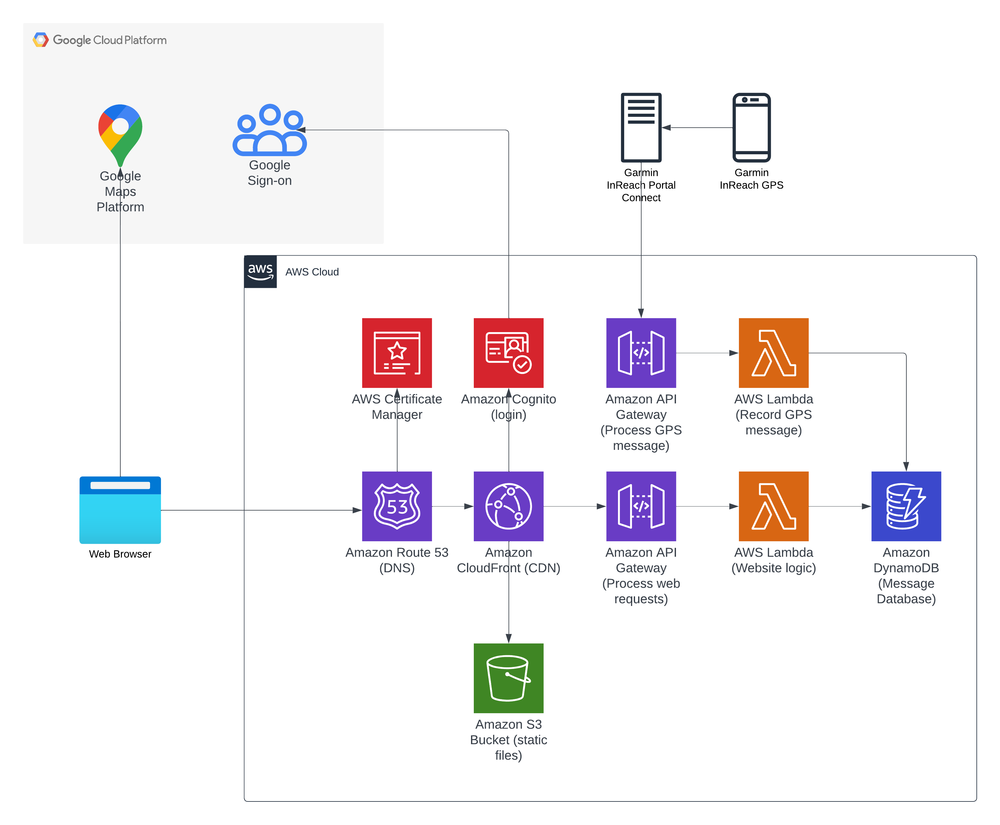

# PCT Tracker Website

**DISCLAIMER: This project is 100% a passion project written by an independent developer for their own usecase. It is being shared as a resource for those interested in replicating. However, you take full ownership and responsibility for what you deploy online. Attempts were made to follow security best practices (least privilege, secure secret storage, authentication and authorization) but your mileage may vary.**

---

This repo contains code for a cloud-based website allowing users to share their progress on hikes with friends and family using a Garmin InReach device. Every time a message is sent from the device the location and message is recorded using Garmin's Portal Connect API. Users can log into the website via Google Sign-on to see on a map where messages have been sent as well as the message content. Users can also leave comments in a running chatbox and view pictures uploaded to Google Photos.

This website was designed initially to keep those I care about up to date while I was hiking the Pacific Crest Trail. It also helped me learn more about the AWS Cloud Development Kit, React, and TypeScript.

## Project Infrastructure

There are two main folders in this project:
1. The cdk-stacks folder contains all the code for deploying the cloud solution to host and run the website in AWS. It does this using the AWS Cloud Development Kit to provide infrastructure as code.
1. The frontend folder contains all the code for a React app. It was bootstrapped using Create-React-App, is written predominantly in TypeScript, and uses the Chakra UI library. During deployment the React project automatically gets built and uploaded to an S3 bucket. This is then distributed via a the Amazon CloudFront CDN to make it globally accessible.

Below is an architecture diagram of what is deployed with this project:

## Deployment steps

These instructions are not exhaustive and assume a lot in the pre-requisites. I have tried my best to link to other guides but it may be incomplete. This is due to the complexity of the project and the limited amount of time I have. Eventually I hope to return here and make deployment easier but until then feel free to reach out to me at dkocen0@gmail.com if you have deployment questions or want some help.

### Prerequisites
1. An active AWS account with administrator permissions [setup for using CDK](https://docs.aws.amazon.com/cdk/v2/guide/getting_started.html). This project assumes the us-west-2 region.
1. A domain name you own, [associated with a Route53 hosted zone](https://docs.aws.amazon.com/Route53/latest/DeveloperGuide/domain-register.html) and has a [valid ACM certificate](https://docs.aws.amazon.com/acm/latest/userguide/gs-acm-request-public.html)
    - Unless you have a reason otherwise I recommend buying and setting up the domain from the start with Route53. This will automatically make a hosted zone for you and makes getting a valid ACM certificate easy. For instructions see the [To register a new domain using Route 53](https://docs.aws.amazon.com/Route53/latest/DeveloperGuide/domain-register.html) section. For the ACM certificate make sure it is valid for **.[yourdomain]*
1. A valid [Google maps key](https://developers.google.com/maps/documentation/javascript/get-api-key) in Google Cloud Platform (GCP)
1. A valid [OAuth 2.0 Client ID](https://support.google.com/cloud/answer/6158849?hl=en) in GCP.
1. A valid [Garmin InReach Pro Account](https://www.garmin.com/en-US/p/837481). Please note it must be pro account in order to access Garmin's InReach API.
1. A valid Google Photos album

Note that the scripts for easily deploying this project are written for Powershell. If you do not have access to Powershell you will need to manually deploy. This will likely take the form of walking through the various npm scripts and running all the commands for relevant scripts in the terminal language of your choice.
### Deployment Instructions

1. [Create an AWS Secret Manager secret](https://docs.aws.amazon.com/secretsmanager/latest/userguide/create_secret.html) for your Google OAuth 2.0 client ID secret. This should be in the same region where you plan to deploy the project.
1. Open a new Powershell terminal and navigate to the cdk stacks folder cdk-stacks`.
1. Run `npm install`.
1. Run `npm run configure` and fill in the required values. For more details about what each value should be open [config.params.json file](/cdk-stacks/config.params.json).
1. Run `npm run deploy` to deploy the backend and build and deploy the frontend.
1. Now that the webapp is deployed you must connect it with your Garmin Portal Connect account.
    1. Open the AWS Management Console and navigate to Secrets Manager.
    1. Open the `GarminAPIAuthToken` secret and copy the secret value.
    1. In another tab navigate to [https://explore.garmin.com/IPC](https://explore.garmin.com/IPC) and login.
    1. Turn on Outbound Settings
    1. For Auth method choose authorization token
    1. For the authorization token value paste the value of your `GarminAPIAuthToken` secret.
    1. Back on the AWS Management Console navigate to API Gateway.
    1. Open the `PCTTracker-GarminAPI` API
    1. Copy the `Invoke URL` for the prod stage.
    1. Back under the Garmin Portal Connect settings, under `Outbound URL` paste the `Invoke URL` you just copied.
    1. To the end of the `Invoke URL` add '/messages'. The entire URL should now be `[YOUR INVOKE URL]/messages`.
    1. Save the settings changes.
1. You should now be able to connect to the webapp using any web browser by accessing your registered domain name.
